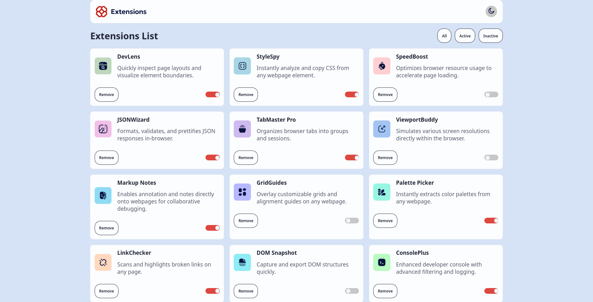
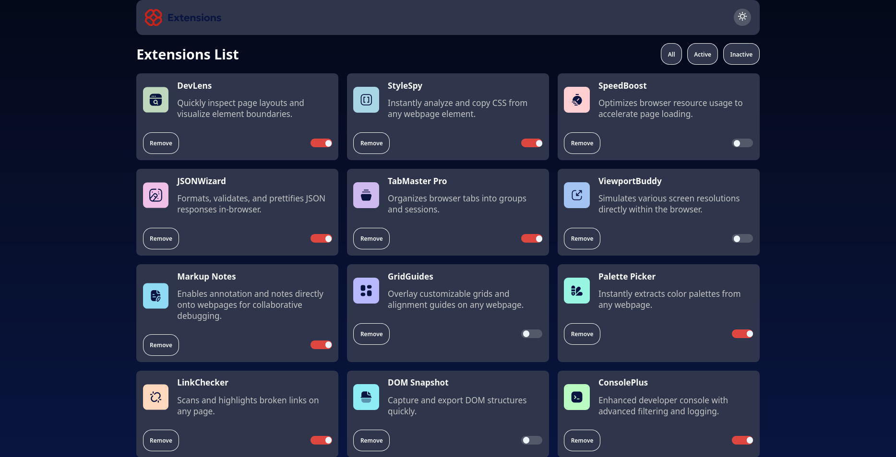

# React + Vite SmartExtensionDashboard 📊

## Table of contents


- [Overview](#overview)
    - [Screenshot](#screenshot)
  - [The challenge](#the-challenge)  
  - [Links](#links)
- [My process](#my-process)
  - [Built with](#built-with)
  - [What I learned](#what-i-learned)
  - [Continued development](#continued-development)
  - [Useful resources](#useful-resources)
- [Author](#author)
- [Acknowledgments](#acknowledgments)

## 🔍 Overview

- I created a toggle switch (slider) in React that flips between active and inactive states. It’s simple, polished, and a great way to practice handling state, events, and conditional styling in a real-world scenario.

## Screenshot




## 🛠 Challenges I faced & how I fixed them

1. ```useEffect``` confusion

- Problem: I wasn’t sure why it ran more than once.

- Fix: Learned that React runs useEffect on every render unless you add a dependency array. In development (Strict Mode), it even runs twice for safety checks.

2. Slider not updating visually

- Problem: I initially hard-coded ```checked``` in the input, so it stayed stuck on true.

-  Fix: Bound it to state with ```checked={isActive}``` and updated it via — now it syncs perfectly.

3. Overusing clsx on the label

- Problem: I tried adding dynamic classes everywhere using ```clsx```, even where it wasn’t needed.

- Fix: Simplified it — used one clean conditional style and dropped unnecessary logic.


## 🔗 Links
[Live site HERE]()


## ⚙ Built with

- React – to build the component logic

- Tailwind CSS – for quick, clean styling

- clsx – to manage conditional classes (but learned not to overdo it!)

- VS Code – my go-to editor for React projects

## 📚 What I learned

- The difference between writing just ```checked``` vs ```checked={state}``` in React.

- How useEffect works under the hood and why it sometimes runs twice in development.

- Not every element needs fancy dynamic class handling — keep it simple when you can.

## 📝 My process

- Started with a plain checkbox to test functionality.

- Added React state to control the active/inactive toggle.

- Styled it using Tailwind to look and feel like a real slider.

- Cleaned up the code — removed unnecessary logic and kept it lean.

- Tested thoroughly to confirm both visual updates and state updates worked correctly.

## 🚀 Continued development

- Add smooth animations for a better toggle effect.

- Make it reusable with props like defaultChecked or custom colors.

- Possibly connect it to real app logic — e.g., a dark mode toggle or settings switch.

This template provides a minimal setup to get React working in Vite with HMR and some ESLint rules.

Currently, two official plugins are available:

- [@vitejs/plugin-react](https://github.com/vitejs/vite-plugin-react/blob/main/packages/plugin-react) uses [Babel](https://babeljs.io/) for Fast Refresh
- [@vitejs/plugin-react-swc](https://github.com/vitejs/vite-plugin-react/blob/main/packages/plugin-react-swc) uses [SWC](https://swc.rs/) for Fast Refresh

## Expanding the ESLint configuration

If you are developing a production application, we recommend using TypeScript with type-aware lint rules enabled. Check out the [TS template](https://github.com/vitejs/vite/tree/main/packages/create-vite/template-react-ts) for information on how to integrate TypeScript and [`typescript-eslint`](https://typescript-eslint.io) in your project.
